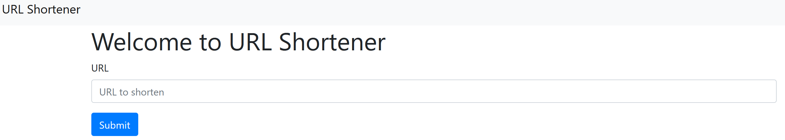
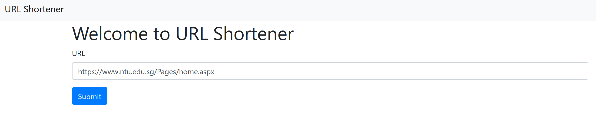
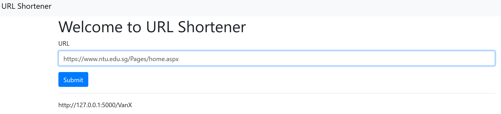

# URL Shortener

URL Shortener is a web generator that allows users to input a lengthy URL and it will return a new shortened URL at the bottom of the page.

Tech stack used: Python 3

<hr>

## Setting up dependencies

Install Flask and the Hashids library using the pip package installer

```bash
pip install flask hashids
```

In the case of unable to import sqlite3 using Anaconda Python, download the [sqlite3](https://www.sqlite.org/download.html) dll of your system version and put it into the folder C:\Users\YOURUSER\Anaconda3\DLLs.

<hr>

## Usage

Specify the application to run the app.py file and to run in development mode.

```bash
export FLASK_APP=app
export FLASK_ENV=development
```

To run the application.

```bash
flask run
```

<hr>

## UI Screenshots

Home screen

<br></br>
Enter long URL

<br></br>
Submit

<br></br>
Copy & paste shortened URL

<br></br>
Redirect to original URL page

